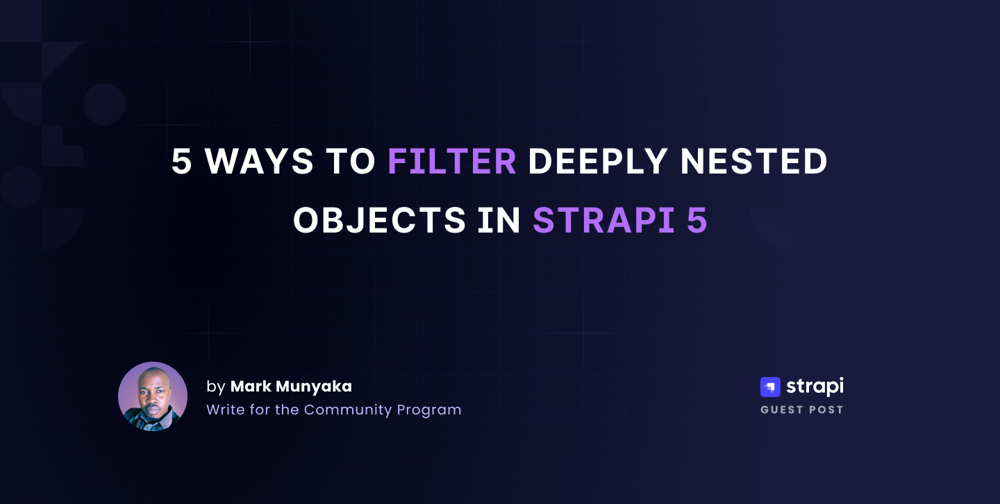

# How to Filter deeply nested results in Strapi


## Description

This repository contains the source code for the article: [How to Filter Results on Deeply-Nested fields in Strapi](https://strapi.io/blog/deep-filtering-alpha-26), written for [Strapi's Blog](https://strapi.io/blog).

## Prerequisites

To test out the source code you will need the following installed:
- [Node.js LTS v18 or v20](https://nodejs.org)

## Getting started

Clone the repository.
```bash
git clone https://github.com/Marktawa/supreme-disco.git
```

## Install dependencies

```bash
cd supreme-disco/my-strapi-project
```

```bash
npm install
```

## Setup environment variables.

```bash
cp .env.example .env
```

## Register Admin

Create admin user with email `chef@strapi.io` and password `Gourmet1234`.
```bash
npm run strapi admin:create-user -- --firstname=Kai --lastname=Doe --email=chef@strapi.io --password=Gourmet1234
```

## Test out code

Run your Strapi app.
```bash
npm run develop
```

Login to your Strapi admin by visiting [localhost:1337/admin](http://localhost:1337/admin) and login using admin user with email `chef@strapi.io` and password `Gourmet1234`.


Clicking on **Login** gives you the Strapi Admin Dashboard Home page:


Check to see if Public Read access to your API is enabled

Click on `Settings` > `Users & Permissions Plugin` > `Roles` > `Public` > `Permissions`.

If not enable Public Read access to your `Book` and `Author` collection API. 


## Deep Filtering Using the REST API

Run the following command in your terminal:
```shell
curl --globoff localhost:1337/api/books?filters\[authors\][hobby][$contains]=dance
```

You should get the following response:
```json
{
    "data": [
        {
            "id": 10,
            "documentId": "kte9yxf6oami3680br3gapfl",
            "title": "How to be Flexible",
            "createdAt": "2025-01-16T05:49:53.037Z",
            "updatedAt": "2025-01-16T06:06:43.838Z",
            "publishedAt": "2025-01-16T06:06:43.851Z"
        },
        {
            "id": 6,
            "documentId": "mfnvnveobtf4fzporv9k2z3x",
            "title": "How to Dance",
            "createdAt": "2025-01-16T05:49:27.517Z",
            "updatedAt": "2025-01-16T05:49:27.517Z",
            "publishedAt": "2025-01-16T05:49:27.522Z"
        }
    ],
    "meta": {
        "pagination": {
            "page": 1,
            "pageSize": 25,
            "pageCount": 1,
            "total": 2
        }
    }
}
```

## Deep Filtering Using the Document Service API

>*NOTE: Instructions apply for `Query Engine API` and `Entity Service API` as well*

Run the following command in your terminal:
```shell
curl localhost:1337/api/dance-books
```

Expected response:
```json
[
    {
        "id": 5,
        "documentId": "mfnvnveobtf4fzporv9k2z3x",
        "title": "How to Dance",
        "createdAt": "2025-01-16T05:49:27.517Z",
        "updatedAt": "2025-01-16T05:49:27.517Z",
        "publishedAt": null,
        "locale": null
    },
    {
        "id": 7,
        "documentId": "kte9yxf6oami3680br3gapfl",
        "title": "How to be Flexible",
        "createdAt": "2025-01-16T05:49:53.037Z",
        "updatedAt": "2025-01-16T06:06:43.838Z",
        "publishedAt": null,
        "locale": null
    }
]
```

## Deep Filtering Using the GraphQL API

Navigate to GraphQL Playground. [localhost:1337/graphql](http://localhost:1337/graphql)

The following GraphQL query will give back all the books whose author’s hobby contains the word “dance”:

```js
query {
  books (filters: { authors:{hobby : { contains: "dance" }}} ){
    authors {
      hobby
    }
    title
  }
}
```

The playground should look like the image below:


## Resources

- [Article](https://strapi.io/blog/deep-filtering-alpha-26)
- [REST API Docs](https://docs.strapi.io/dev-docs/api/rest)
- [Document Service API Docs](https://docs.strapi.io/dev-docs/api/document-service)
- [Query Engine API Docs](https://docs.strapi.io/dev-docs/api/query-engine)
- [GraphQL API Docs](https://docs.strapi.io/dev-docs/api/graphql)
- [Entity Service API Docs](https://docs.strapi.io/dev-docs/api/entity-service)



## Author

Mark Munyaka  
[dev.to/markmunyaka](https://dev.to/markmunyaka)


